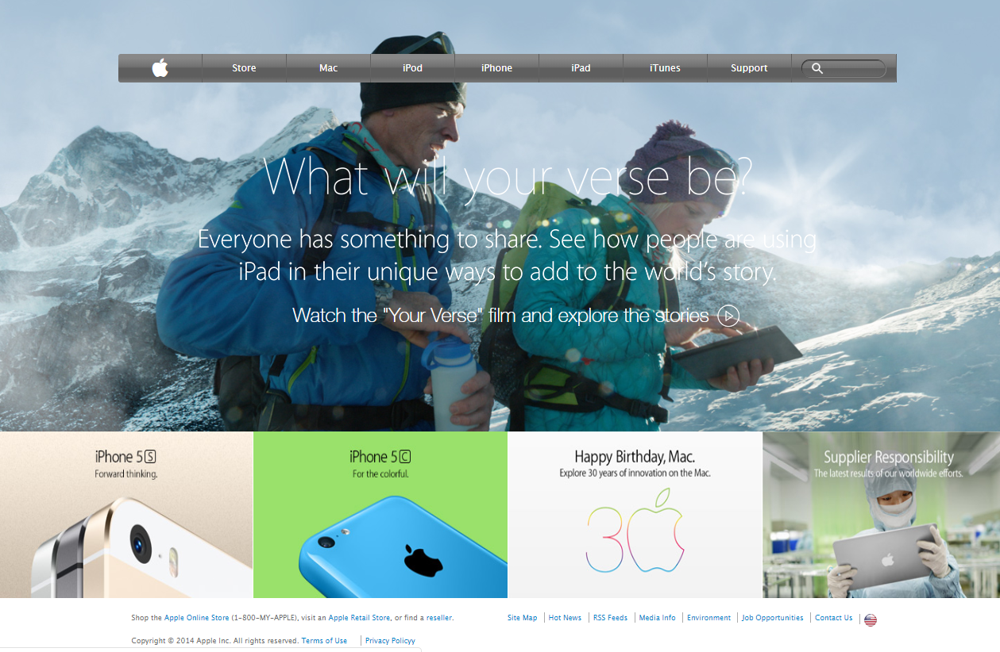

# backgrounds-and-gradients

This project consists of building a webpage using images as a background and adding gradients to elements. The goal is to make a clone of old an old version of the Apple website webpage.

## Built With

- HTML and CSS

## Live Demo

[Live Demo Link](https://mikethreels.github.io/backgrounds-and-gradients/)

## Getting Started

To get a local copy up and running follow these simple example steps.

git clone https://github.com/mikethreels/backgrounds-and-gradients.git 
Open the index.html with your favorite browser
Explore our site

### Usage
- Just open the `index.html` file

## Author

👤 **Michael Threels**

- Github: [@githubhandle](https://github.com/mikethreels)
- Twitter: [@twitterhandle](https://twitter.com/MichaelThreels)
- LinkedIn :[@linkedinhandle](https://www.linkedin.com/in/michael-threels-24101991) 

## 🤝 Contributing

Contributions, issues and feature requests are welcome!

Feel free to check the [issues page](issues/).

## Show your support

Give a ⭐️ if you like this project!

## Acknowledgments

- Hat tip to anyone whose code was used
- Inspiration
- etc

## 📝 License

This project is [MIT](lic.url) licensed.